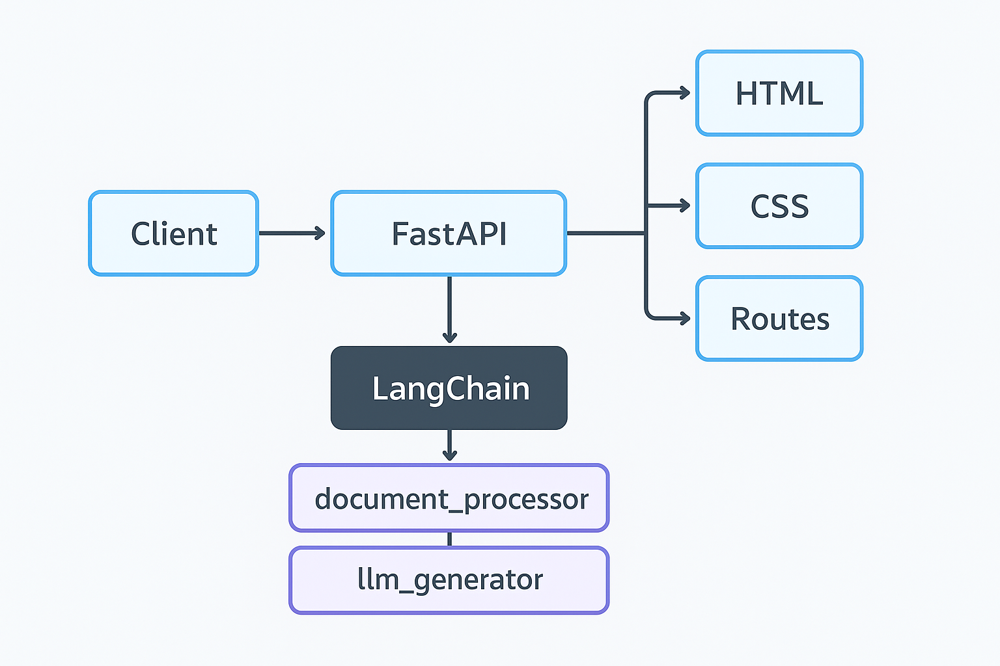
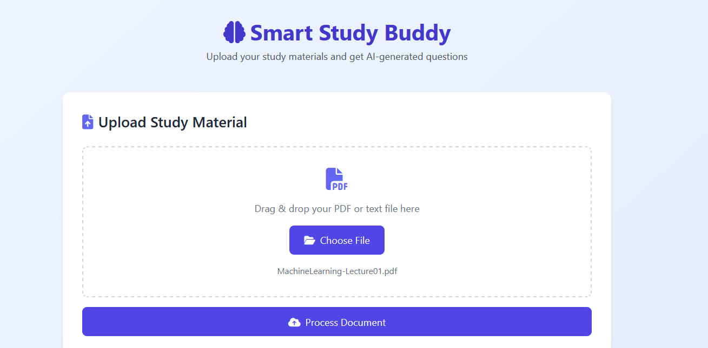
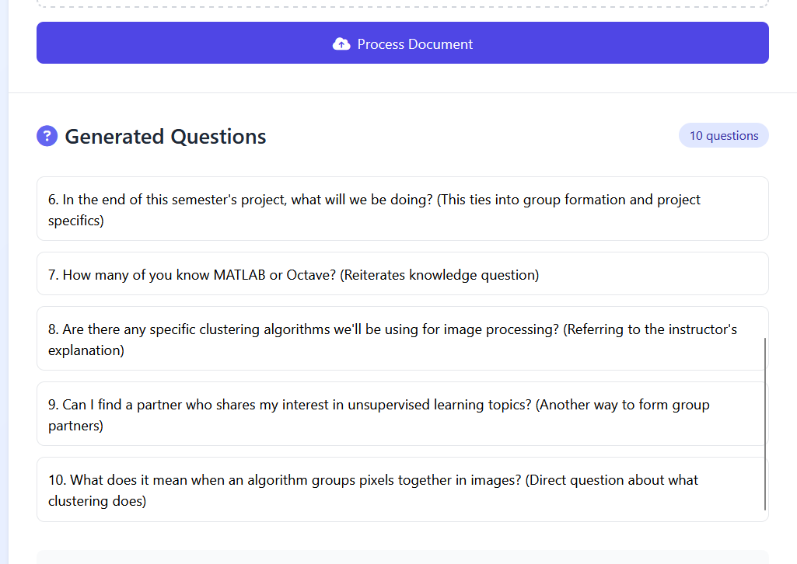
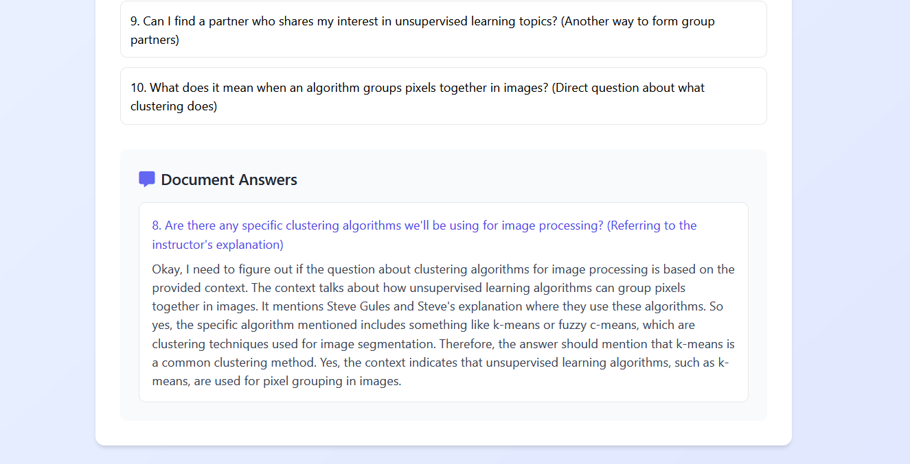

# Smart Study Buddy

[](https://fastapi.tiangolo.com)
[](https://ollama.ai)

An AI-powered study assistant that generates contextual questions and answers from uploaded documents using local LLMs.

---

## Project Overview

Traditional study tools require manual question creation and lack contextual understanding. This system automates:

- Document processing and semantic chunking
- AI-generated question formulation
- Context-aware answer generation
- Vector-based knowledge retrieval

The solution combines local LLMs with modular architecture for privacy-focused educational assistance.

---

## Features

- Document processing pipeline for PDF/TXT files
- Semantic search using FAISS vector store
- Prompt-engineered question generation
- Context-aware answer extraction
- Local model execution via Ollama
- REST API backend with web interface

---

### Core Components:
1. **Document Processor**: Handles file uploads, text extraction, and chunking
2. **Vector Engine**: Creates and manages FAISS vector stores using BGE embeddings
3. **Question Generator**: Uses DeepSeek-1.5B to create study questions
4. **Answer Engine**: Context-aware response generation from document content
5. **Web Interface**: Interactive UI for document upload and Q/A

This architecture enables secure local processing while maintaining scalability through separated components.

---

## Workflow & Screenshots

### Document Processing Flow
1. File upload and text extraction
2. Chunking with semantic overlap
3. Vector embedding generation
4. Context storage in FAISS database

<p align="center">
  
</p>

### Interface Demonstration

**Document Upload Interface**


**Generated Questions Display**


**Contextual Answer Generation**


---

## Installation & Deployment

1. Clone repository:
```bash
git clone https://github.com/yourusername/smart-study-buddy.git
cd smart-study-buddy
